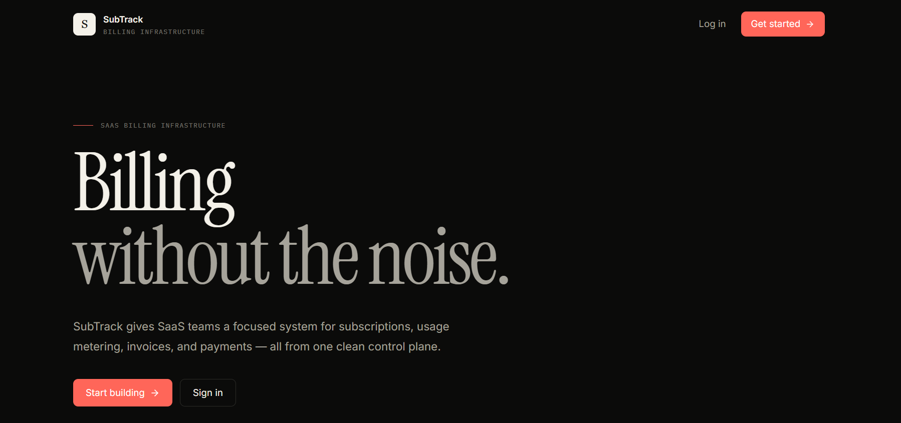
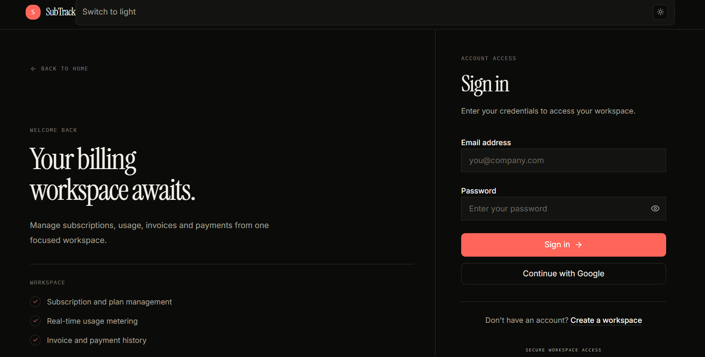
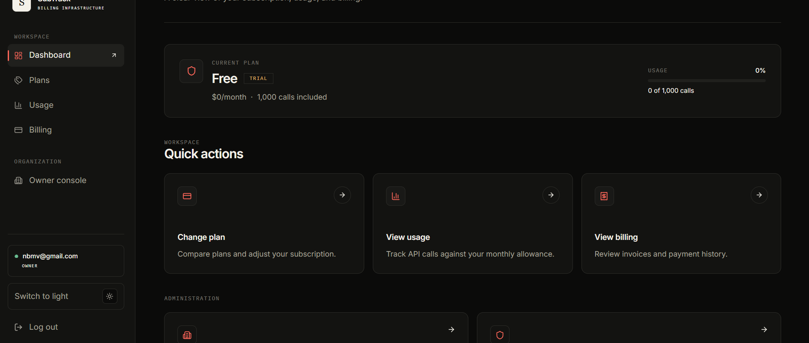
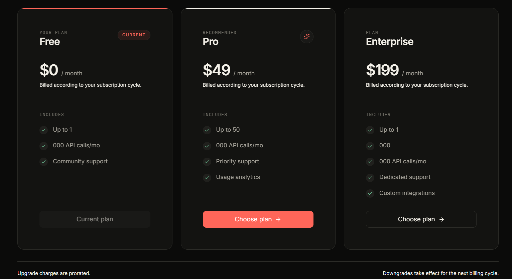
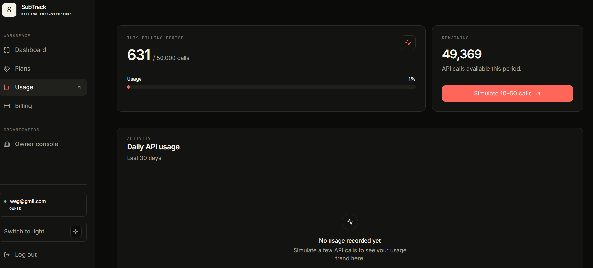
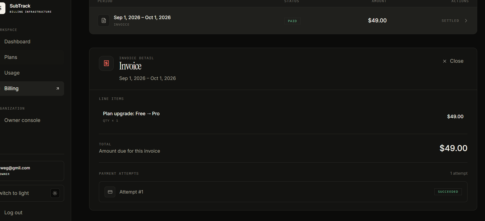
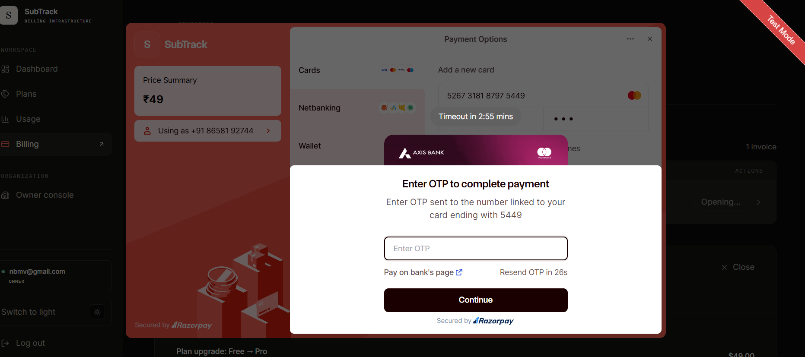

# SubTrack

### Multi-Tenant SaaS Subscription & Billing Platform

SubTrack is a full-stack SaaS subscription and billing platform designed around the core backend architecture used by modern subscription-based products.

The platform supports organization-based multi-tenancy, subscription plans, usage metering, automated billing, invoice management, Razorpay payments, JWT authentication, Google OAuth2, role-based authorization, and a dedicated platform administration layer.

The project focuses primarily on **backend engineering, SaaS architecture, payment workflows, tenant isolation, billing correctness, and production-oriented design** rather than simple CRUD operations.

---

## 🚀 Highlights

- Multi-tenant SaaS architecture
- Organization-level tenant isolation
- JWT authentication
- Google OAuth2 authentication
- Role-based authorization
- Separate platform-admin authentication
- Subscription lifecycle management
- Plan upgrades and downgrades
- Prorated upgrade billing
- Usage-based metering
- Automated billing cycles
- Invoice generation and tracking
- Razorpay payment integration
- Server-side payment signature verification
- Payment webhook support
- Autopay support
- Duplicate billing protection
- PostgreSQL persistence
- Redis-backed infrastructure
- Flyway database migrations
- Platform administration dashboard
- Responsive React frontend
- OpenAPI / Swagger documentation

---

# ✨ Features

## 🔐 Authentication & Authorization

SubTrack provides multiple authentication mechanisms:

- Email/password signup
- Email/password login
- JWT-based authentication
- Google OAuth2 login
- Separate organization-user and platform-admin authentication
- Role-based access control
- Organization roles such as:
  - `OWNER`
  - `ADMIN`
- Platform-level role:
  - `PLATFORM_ADMIN`
- Protected REST APIs
- Tenant-aware request processing

JWT tokens contain the authenticated user's identity, role, and organization context where applicable.

Platform administrators operate outside the organization tenant scope.

---

# 🏢 Multi-Tenancy

SubTrack is designed as a multi-tenant SaaS application.

Each organization acts as an isolated tenant.

### Tenant model

```text
User
  │
  └── Organization
          │
          ├── Subscription
          │
          ├── Usage
          │
          ├── Billing Cycles
          │
          ├── Invoices
          │
          └── Payments
```

Tenant context is resolved from the authenticated request and used by organization-scoped services.

This prevents regular users from accessing another organization's:

- subscriptions
- invoices
- payments
- usage information
- organization data

Platform administrators have separate global-level access.

---

# 💳 Subscription Management

SubTrack supports a complete subscription lifecycle.

### Supported operations

- Free/trial subscription
- Paid plans
- Plan upgrades
- Plan downgrades
- Subscription cancellation
- Subscription status tracking
- Billing-period tracking
- Current-period tracking
- Prorated upgrades
- Payment-dependent activation

### Upgrade flow

When a customer upgrades from one paid plan to a more expensive plan:

```text
Existing Plan
      │
      ▼
Calculate remaining billing period
      │
      ▼
Calculate unused credit
      │
      ▼
Calculate prorated upgrade amount
      │
      ▼
Generate payment amount
      │
      ▼
Razorpay Payment
      │
      ▼
Payment Verification
      │
      ▼
Subscription Activation
```

This prevents the customer from being charged the full new-plan price when only a prorated difference is due.

---

# 🧾 Billing & Invoicing

The billing subsystem handles recurring billing and invoice generation.

### Features

- Automated billing cycle
- Monthly billing
- Invoice generation
- Invoice line items
- Invoice history
- Payment status tracking
- Billing cycle tracking
- Duplicate billing protection
- Failed payment handling
- Payment attempt tracking

Billing cycles use organization/month uniqueness protection to prevent duplicate invoices from concurrent billing operations.

### Free plan handling

Free plans should not generate unnecessary zero-value invoices.

Instead, the billing cycle records that the free-plan billing operation was skipped.

```text
Free Plan
   │
   ▼
Billing Cycle
   │
   └── SKIPPED_FREE_PLAN
```

---

# 💰 Razorpay Payments

SubTrack integrates Razorpay for payment processing.

### Payment flow

```text
Frontend
   │
   ▼
Create Razorpay Order
   │
   ▼
Razorpay Checkout
   │
   ▼
Customer Payment
   │
   ▼
Razorpay Response
   │
   ▼
Backend Signature Verification
   │
   ▼
Payment Persistence
   │
   ▼
Invoice / Subscription Update
```

### Supported functionality

- Razorpay order creation
- Razorpay checkout
- Payment verification
- Server-side signature verification
- Invoice/payment synchronization
- Payment persistence
- Payment attempts
- Webhook support
- Autopay payment-token support
- Failed-payment handling

The backend is responsible for validating payment signatures rather than trusting payment information supplied directly by the frontend.

---

# 🔁 Autopay

SubTrack supports optional autopay for eligible subscriptions.

Autopay can be enabled after a successful payment has established a valid payment method/token.

```text
Successful Razorpay Payment
          │
          ▼
Payment Token Stored
          │
          ▼
Autopay Enabled
          │
          ▼
Future Billing Cycle
          │
          ▼
Automatic Payment Attempt
```

---

# 📊 Usage Metering

The usage subsystem tracks customer consumption during the current billing period.

### Features

- Record usage
- Current-period usage
- Usage limits
- Daily usage breakdown
- Plan-based usage limits
- Redis-backed infrastructure

Example:

```text
Subscription Plan
       │
       ▼
Maximum Usage
       │
       ▼
Usage Recording
       │
       ▼
Current Period Usage
       │
       ▼
Usage Dashboard
```

---

# 🛡️ Platform Administration

SubTrack contains a separate platform administration layer.

Platform administrators are different from organization-level owners and admins.

### Admin capabilities

- Dedicated admin authentication
- Admin login
- Admin dashboard
- Organization overview
- Subscription overview
- MRR metrics
- Active subscription metrics
- Churn metrics
- Organization management
- Organization details
- Organization status management
- Platform-level organization visibility

The platform admin operates without an organization tenant context.

---

# 🏗️ Architecture

```text
                         ┌───────────────────────────┐
                         │      React + Vite         │
                         │   TypeScript Frontend     │
                         └─────────────┬─────────────┘
                                       │
                              REST APIs / OAuth2
                                       │
                                       ▼
                    ┌─────────────────────────────────┐
                    │         Spring Boot API         │
                    │                                 │
                    │  Security / JWT / OAuth2        │
                    │  Controllers                    │
                    │  Services                       │
                    │  Tenant Context                 │
                    │  Billing                        │
                    │  Subscription Management        │
                    │  Payment Processing             │
                    └───────────────┬─────────────────┘
                                    │
              ┌─────────────────────┼─────────────────────┐
              │                     │                     │
              ▼                     ▼                     ▼
      ┌───────────────┐     ┌───────────────┐     ┌───────────────┐
      │  PostgreSQL   │     │     Redis     │     │   Razorpay    │
      │               │     │               │     │               │
      │ Organizations │     │ Usage         │     │ Orders        │
      │ Users         │     │ Infrastructure│     │ Payments      │
      │ Plans         │     │ Rate Limiting │     │ Verification  │
      │ Subscriptions │     │               │     │ Webhooks      │
      │ Invoices      │     │               │     │               │
      │ Payments      │     │               │     │               │
      └───────────────┘     └───────────────┘     └───────────────┘
```

---

# 🧩 Technology Stack

## Backend

| Technology | Purpose |
|---|---|
| Java 25 | Backend language |
| Spring Boot | Application framework |
| Spring Security | Authentication & authorization |
| Spring Data JPA | Persistence layer |
| Spring OAuth2 Client | Google OAuth2 |
| JWT | Stateless authentication |
| PostgreSQL | Primary database |
| Flyway | Database migrations |
| Redis | Usage/infrastructure support |
| Razorpay Java SDK | Payment processing |
| Springdoc OpenAPI | API documentation |
| Lombok | Boilerplate reduction |

The current backend Maven configuration uses Java 25 and Spring Boot, with PostgreSQL/Flyway, Redis, OAuth2, JWT, Razorpay and OpenAPI dependencies. 

## Frontend

| Technology | Purpose |
|---|---|
| React | UI |
| TypeScript | Type-safe frontend development |
| Vite | Frontend tooling |
| React Router | Routing |
| Axios | API communication |
| Zustand | Application/session state |
| React Query | Server state management |
| Tailwind CSS | Styling |
| Framer Motion | UI animations |
| Lucide React | Icons |
| Zod | Validation |
| React Hook Form | Form management |

---

# 🗄️ Database

PostgreSQL is the primary persistence layer.

Core domain entities include:

```text
Organization
     │
     ├── User
     │
     └── Subscription
             │
             └── Plan
             
Subscription
     │
     ├── Billing Cycle
     │
     ├── Invoice
     │       │
     │       └── Invoice Line Items
     │
     └── Payment
```

Database schema changes are managed through Flyway migrations.

Hibernate uses schema validation rather than owning schema creation.

---

# 🐳 Docker Infrastructure

The development infrastructure uses Docker Compose for PostgreSQL and Redis.

```bash
docker compose up -d
```

This starts:

```text
PostgreSQL
localhost:5432

Redis
localhost:6379
```

The PostgreSQL database is configured as:

```text
Database: subtrack
Username: subtrack
Password: subtrack
```

For production environments, credentials should be supplied through environment variables or a secrets manager rather than committed configuration.

---

# ⚙️ Local Development

## Prerequisites

Install:

- Java 25
- Maven
- Node.js
- npm / pnpm
- Docker Desktop
- PostgreSQL-compatible Docker environment
- Redis-compatible Docker environment

---

## 1. Clone the repository

```bash
git clone https://github.com/anup221/subtrack.git
cd subtrack
```

---

## 2. Start PostgreSQL and Redis

From the project root:

```bash
docker compose up -d
```

Verify the containers:

```bash
docker compose ps
```

---

# 3. Start the Backend

Move into the backend directory:

```bash
cd subtrack
```

Run:

```bash
./mvnw spring-boot:run
```

On Windows:

```bash
mvnw.cmd spring-boot:run
```

The backend runs on:

```text
http://localhost:8080
```

---

# 4. Start the Frontend

Open another terminal:

```bash
cd frontend
```

Install dependencies:

```bash
npm install
```

Start the development server:

```bash
npm run dev
```

The Vite development server will provide the frontend URL in the terminal.

---

# 🔑 Environment Configuration

Do not commit production secrets to GitHub.

Use environment variables for:

- database credentials
- JWT secret
- Google OAuth client ID
- Google OAuth client secret
- Razorpay credentials
- Razorpay webhook secret
- admin bootstrap credentials
- webhook secrets

Example:

```yaml
jwt:
  secret: ${JWT_SECRET}

razorpay:
  key-id: ${RAZORPAY_KEY_ID}
  key-secret: ${RAZORPAY_KEY_SECRET}
  webhook-secret: ${RAZORPAY_WEBHOOK_SECRET}
```

For Google OAuth2:

```text
GOOGLE_CLIENT_ID
GOOGLE_CLIENT_SECRET
```

should be configured through the application's deployment environment.

---

# 🔐 Google OAuth2

SubTrack supports Google OAuth2 authentication for application users and platform administrators.

The OAuth flow is:

```text
User
 │
 ▼
SubTrack Login
 │
 ▼
Google Authorization
 │
 ▼
Google Callback
 │
 ▼
Backend OAuth Handler
 │
 ▼
User / Organization Resolution
 │
 ▼
JWT Session
 │
 ▼
Frontend Dashboard
```

For local development, configure the appropriate OAuth redirect URI in Google Cloud Console.

Example:

```text
http://localhost:8080/login/oauth2/code/google-org
```

and the corresponding admin callback if a separate admin OAuth registration is configured.

---

# 📡 API Overview

## Authentication

```text
POST /api/auth/signup
POST /api/auth/login
```

## Subscriptions

```text
GET  /api/subscriptions/me
POST /api/subscriptions/change-plan
POST /api/subscriptions/cancel
```

## Plans

```text
GET /api/plans
```

## Usage

```text
POST /api/usage/record
GET  /api/usage/summary
```

## Invoices

```text
GET  /api/invoices
GET  /api/invoices/{id}
POST /api/invoices/generate
```

## Payments

```text
POST /api/payments/pay/{invoiceId}
GET  /api/payments/invoice/{invoiceId}
```

## Razorpay

```text
POST /api/payments/razorpay/create-order/{invoiceId}
POST /api/payments/razorpay/verify
```

## Platform Administration

```text
GET /api/admin/metrics
GET /api/admin/tenants
```

Additional endpoints may be added as the administration and organization-management modules evolve.

---

# 🧪 Testing & Verification

Important billing scenarios to verify include:

### Free Plan

```text
Free Plan
   ↓
Monthly Billing Cycle
   ↓
No ₹0/$0 Invoice
   ↓
Billing Cycle marked as skipped
```

### New Paid Subscription

```text
Select Paid Plan
   ↓
Create Payment
   ↓
Razorpay Checkout
   ↓
Verify Payment
   ↓
Activate Subscription
```

### Paid Plan Upgrade

```text
Current Paid Plan
      ↓
Select More Expensive Plan
      ↓
Calculate Remaining Period
      ↓
Calculate Unused Credit
      ↓
Calculate Prorated Difference
      ↓
Payment
      ↓
Verify Payment
      ↓
Activate New Plan
```

### Duplicate Billing

```text
Billing Request
      │
      ▼
Check Existing Billing Cycle
      │
      ├── Exists → Stop
      │
      └── Doesn't Exist
                │
                ▼
         Create Billing Cycle
```

The database uniqueness constraint remains the final protection against concurrent duplicate billing operations.

---

# 📸 Screenshots

## Landing Page



## Login



## Dashboard



## Plans



## Usage & Metering



## Billing & Invoices



## Razorpay Payment



---

# 📁 Project Structure

```text
subtrack/
│
├── frontend/
│   ├── src/
│   │   ├── components/
│   │   ├── lib/
│   │   ├── pages/
│   │   ├── store/
│   │   └── types/
│   │
│   └── package.json
│
├── subtrack/
│   ├── src/
│   │   ├── main/
│   │   │   ├── java/
│   │   │   │   └── com/subtrack/subtrack/
│   │   │   │       ├── auth/
│   │   │   │       ├── admin/
│   │   │   │       ├── billing/
│   │   │   │       ├── organization/
│   │   │   │       ├── payment/
│   │   │   │       ├── plan/
│   │   │   │       ├── subscription/
│   │   │   │       ├── tenant/
│   │   │   │       └── usage/
│   │   │   │
│   │   │   └── resources/
│   │   │       └── db/migration/
│   │   │
│   │   └── test/
│   │
│   └── pom.xml
│
├── assets/
│   └── screenshots/
│
├── docker-compose.yml
└── README.md
```

---

# 🎯 Engineering Concepts Demonstrated

This project demonstrates practical implementation of:

- Multi-tenant SaaS architecture
- Stateless authentication
- JWT security
- OAuth2 authentication
- Role-based authorization
- Tenant context propagation
- Subscription lifecycle management
- Billing-cycle design
- Proration calculations
- Invoice generation
- Payment gateway integration
- Payment signature verification
- Webhook processing
- Idempotency and duplicate-operation protection
- Usage metering
- Redis integration
- PostgreSQL relational modeling
- Database migrations
- REST API design
- Frontend/backend separation
- Docker-based local infrastructure

---

# 🧠 Key Backend Design Decisions

### Tenant Isolation

Organization-specific operations resolve the organization from authenticated tenant context instead of trusting arbitrary organization IDs supplied by clients.

### Database-Level Billing Protection

Application-level checks are combined with database uniqueness constraints to protect against duplicate billing when multiple processes attempt the same billing operation concurrently.

### Server-Side Payment Verification

Payment signatures are verified by the backend before changing payment or subscription state.

### Separation of Platform Admins

Platform administrators are modeled separately from organization-level roles.

This prevents organization owners from automatically gaining platform-level administrative privileges.

### Flyway-Owned Schema

Database schema evolution is handled through migrations, while Hibernate validates the schema.

---

# 🚀 Production Considerations

Before deploying to production, configure:

- HTTPS/TLS
- Production PostgreSQL
- Managed Redis
- Secure secret management
- Production Razorpay credentials
- Razorpay webhook configuration
- Google OAuth production credentials
- Secure OAuth redirect URIs
- CORS policy
- Database backups
- Logging and monitoring
- Error tracking
- Rate limiting
- Secure cookie/session configuration where applicable
- Environment-specific configuration
- CI/CD pipeline
- Health checks
- Database migration strategy

Never commit:

```text
.env
application-prod.yml
OAuth client secrets
JWT secrets
Razorpay secrets
Webhook secrets
Database passwords
```

---

# 📚 API Documentation

When the application is running, Swagger/OpenAPI documentation can be exposed through the configured Springdoc integration.

Use the Swagger UI endpoint provided by the running backend configuration.

---

# 🛣️ Future Improvements

Potential future improvements include:

- Automated subscription renewal
- Advanced dunning workflows
- Email notifications
- Invoice PDF generation
- Subscription pause/resume
- Coupon and discount support
- Tax calculation
- Multiple currencies
- Advanced analytics
- Audit logs
- Distributed locking for billing workers
- CI/CD automation
- Cloud deployment
- Observability with metrics and tracing

---

# 👨‍💻 Author

**Anupam Mohapatra**

GitHub:  
https://github.com/anup221

---

# ⭐ Project

If you find the project useful or interesting, consider giving the repository a star.

**SubTrack — SaaS Subscription & Billing Infrastructure**
